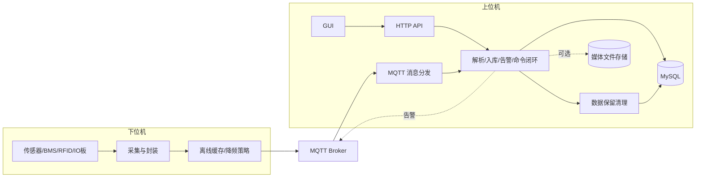
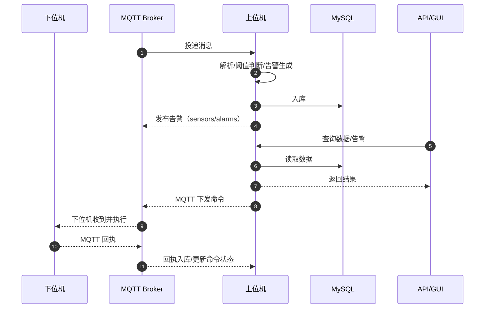
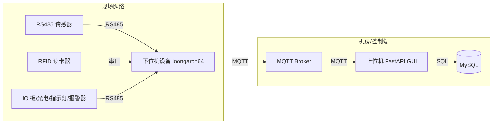

# 系统架构总览

## 1. 项目定位
本系统用于工业安全监测与现场控制：
- **下位机（loongarch64 GNU/Linux，小端，Python 3.9）**：轮询 RS485 传感器、采集 BMS/RFID/IO 板光电输入，控制现场 IO 指示灯和声光报警器，并通过 MQTT 上报。
- **上位机（Windows + Conda）**：FastAPI 提供数据入库与查询、命令下发与回执记录、告警统一广播，并提供 Tkinter GUI。

## 2. 运行环境
- **上位机**：Windows + Conda（推荐 Python 3.11），MySQL + MQTT Broker（如 Mosquitto）。（可选）RTSP/YOLO/音频依赖。
- **下位机**：loongarch64 GNU/Linux，小端，系统 Python 3.9（不使用 venv）。

## 3. 核心模块与职责
### 3.1 下位机
- `client/main.py`：主循环与任务调度（采集、上报、命令回执）。
- `client/communication/serial_manager.py`：串口访问与 Modbus RTU 读写。
- `client/communication/io_board.py`：IO 板输出控制（运行灯、通讯灯、充放电灯、相机灯、避障灯、声光报警器）。
- `client/sensors/*`：传感器解析与统一数据格式化。
- `client/communication/rfid_reader.py`：RFID 串口读取线程。
- `client/communication/mqtt_client.py`：MQTT 连接、订阅、发布与**离线缓存**（可选 `latest` 策略）。

### 3.2 上位机
- `server/app/api/*`：FastAPI 路由与应用工厂。
- `server/app/mqtt/*`：MQTT 连接与消息分发。
- `server/app/services/*`：入库、告警、运行时监督、YOLO/音频等服务。
- `server/app/db/*`：SQLModel 模型、会话管理与表结构维护。
- `server/app/gui/*`：Tkinter GUI。

## 4. 架构与数据流图

### 4.1 总体架构图

源文件：`docs/diagrams/architecture-overview.mmd`

### 4.2 数据上报与命令闭环（序列图）

源文件：`docs/diagrams/data-command-sequence.mmd`

### 4.3 部署拓扑图

源文件：`docs/diagrams/deployment-topology.mmd`

## 5. 部署拓扑与端口清单
> 端口以 `.env` 配置为准；下表为默认值或常见值。

| 组件/链路 | 默认端口 | 说明 | 配置项 |
|---|---:|---|---|
| MQTT Broker | 1883 | 下位机与上位机数据/命令通道 | `MQTT_PORT` |
| HTTP API | 8000 | 上位机 REST API | `API_PORT` |
| MySQL | 3306 | 上位机数据库 | `MYSQL_PORT` |
| RTSP 输入 | 由 URL 决定 | YOLO/音频流输入 | `YOLO_RTSP_INPUT` / `AUDIO_RTSP_INPUT` |
| RTSP 输出 | 由 URL 决定 | YOLO 标注流输出 | `YOLO_RTSP_OUTPUT` |

补充：RS485/串口为本地物理链路，不占网络端口。

## 6. MQTT 主题约定
- `sensors/data`：传感器汇总数据
- `sensors/bms`：BMS 数据
- `sensors/rfid`：RFID 数据
- `sensors/command/request` / `response`：串口命令下发与回执
- `sensors/alarms`：统一告警广播
- `yolo/person_img` / `yolo/annotated_img`：图像快照
- `config/update`：上位机配置下发
- `config/ack`：下位机配置回执
- `device/hello`：下位机启动握手（上报配置版本）

## 7. API 入口（摘要）
- 健康检查：`/api/health`、`/api/health/live`、`/api/health/ready`
- 传感器/BMS/RFID/图像/音频/金属异常：`/api/sensors`、`/api/bms`、`/api/rfid`、`/api/images`、`/api/audio`、`/api/metal-anomaly`
- 命令状态：`/api/command-requests`
- 告警：`/api/alarms`

分页响应补充：

## 8. 数据与告警
- 传感器阈值超限、BMS 低压、音频/YOLO 事件等统一发布到 `sensors/alarms`。
- 上位机入库时可覆盖 `location`（例如使用最新 RFID 卡号）。
- 支持 `payload_type` 字段区分消息类型。

## 9. 兼容性与扩展策略
- **消息结构兼容**：新增字段（`schema`、`ts`、`payload_type`）不影响旧解析。
- **命令闭环可选**：仅在 `request_id` 存在时记录状态。
- **进程隔离可选**：YOLO/音频可设为 `process`，默认仍为线程。
- **媒体存储可选**：`MEDIA_STORAGE_MODE=database|filesystem`，默认数据库。

## 9.1 2026-05 媒体写入与 API 控制面隔离
- 新增 `media-write-worker`，用于异步消费 `telemetry.yolo.snapshot` / `telemetry.audio.clip` 并执行媒体写入与告警发布。
- `TelemetryBridgeServer` 改为快速 ACK 模式：接收 telemetry 后只做校验与入队，不在 API 线程同步执行 DB/MQTT。
- 新增 `media_db_worker`，将 `/api/images`、`/api/audio` 的写入流量与常规查询流量拆分，降低控制面查询被媒体写入回压的风险。

## 10. 运行期配置热更新
- 上位机 `runtime_config` 作为覆盖层，API `/api/runtime-config` 提供读取与更新。
- 下位机启动发送 `device/hello`，上位机检测版本不一致则通过 `config/update` 下发。
- 下位机处理 `config/update`，可热更项即时生效；需重启项写入 `config_override.json` 并回执 `pending_restart_keys`。
- 可热更示例：
  - 上位机：`COMMAND_TIMEOUT_SECONDS`、`DATA_RETENTION_*`
  - 下位机：`SENSOR_POLL_DELAY`、`BMS_POLL_INTERVAL`、`MQTT_DEGRADE_*`、`MQTT_OFFLINE_*`
- 需重启示例：`MQTT_BROKER`、`MQTT_PORT`、`MQTT_CLIENT_ID`

## 11. 数据保留与稳定性
- 支持按**天数**或**容量**自动清理历史数据（`DATA_RETENTION_*`）。
- 保留检查线程由运行时守护启动，避免数据库长期膨胀。

## 12. 图像导出（Mermaid CLI）
- 源文件：`docs/diagrams/*.mmd`
- 输出目录：`docs/diagrams/output/*.svg`、`docs/diagrams/output/*.png`
- 脚本：`docs/scripts/render-mermaid.sh` / `docs/scripts/render-mermaid.ps1`
- 配置：`docs/diagrams/mermaid-config.json`（中文字体与样式）

安装与生成：
```bash
npm install -g @mermaid-js/mermaid-cli
"./docs/scripts/render-mermaid.sh"
```

Windows PowerShell：
```powershell
npm install -g @mermaid-js/mermaid-cli
./docs/scripts/render-mermaid.ps1
```

Windows 亦可在 Git Bash/WSL 中执行 `.sh` 脚本，或直接运行 `mmdc`。

## 13. 文档导航
- 上位机说明：`server/README.md`
- 上位机细节：`server/PLANNING.md`
- 下位机说明：`client/README.md`
- 下位机细节：`client/PLANNING.md`
## 2026-04 PLC Control Update

- Cableway PLC access is now server-only. The lower computer no longer polls or controls the PLC.
- `/api/cableway/command` executes Modbus TCP operations directly on the server; MQTT `cableway/command/request` and `cableway/command/response` are no longer part of the control path.
- Background polling keeps a minimal register set hot: `VD2244`, `VD2248`, `VD2252`, `VW2432`, `V2889.7`, `V2909.0`, `V2909.1`.
- When `GZ total fault` is active, the server performs an additional fault-detail read to decode the remaining alarm bits.
- PLC control work is scheduled ahead of background polling through a single worker queue.
